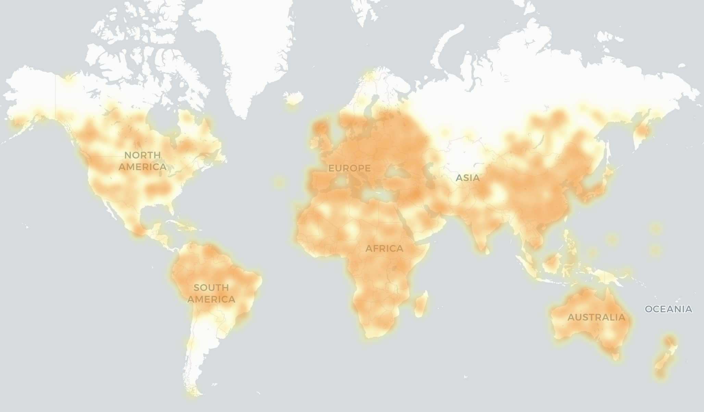

# SolExplore: A Successive Refinement Approach for Sizing of PV and Storage Systems in EV-Enabled Homes

## Overview

This project provides a framework for rapidly determining the optimal sizing of battery and photovoltaic (PV) systems for buildings with and without electric vehicles (EVs). It automates the process of fetching and processing load and solar irradiance data, creating a labeled dataset and training a machine learning model for fast sizing predictions.

## Project Workflow

The project follows these key steps:

1.  **Data Acquisition:** Obtaining hourly load and solar generation data over a one-year period. Additionally, EV traces are created using SPAGHETTI [4].
2.  **Data Preparation:** Cleaning, processing, and augmenting the raw data to create a comprehensive dataset.
3.  **Optimal Sizing Labeling:** Utilizing simulators [3,5] to calculate the optimal battery and PV sizes for each combination of load and solar profiles.
4.  **Model Training:** Training an MLP to predict optimal sizing based on load and solar data.
5.  **Model Evaluation:** Evaluating the model on different datasets to test robustness to out-of-sample data.

## Data Preparation Details

### Load Data

The process for acquiring and preparing household electricity load data involves the following steps:

1.  **Fetching Load Traces:** The `data/load/fetch_load.py` script is used to retrieve load data from the Faraday dataset [1]. This script fetches data for each day of the year. Ensure no requests have failed before moving on to step 2.
2.  **Processing Raw Data:** The raw responses from Faraday are then processed by `data/load/prepare_inputs.py` to generate hourly load profiles spanning one year for each household.
3.  **Split** The data is split into test, validation and training sets using `data/split_dataset.py`.
4.  **Data Augmentation:** To enforce stronger weekday patterns, run `data/load/smooth_data.py`.To increase the size and robustness of the dataset, `data/load/augment_data.py` adds noise to the original load traces to increase variation and grow the datset. Load traces are also scaled and shifted in time to approximate consumption outside the UK.

### Solar Data

The process for acquiring and preparing solar photovoltaic generation data involves the following steps:

1.  **Fetching Solar Traces:** The `data/solar/fetch_solar.py` script retrieves hourly solar irradiance data using the PVWatts API [2].
    Some locations may have insufficient weather data available which results in failed requests for those locations (in our case mainly regions of Russia, Kazakhstan and Argentina). A heatmap of the origins of our data is shown in the figure below.
2.  **Split** The data is split into test, validation and training sets using `data/split_dataset.py`.
3.  **Data Augmentation:** Similar to the load data, `data/solar/add_noisy_data.py` augments the original solar traces to expand the dataset.

### EV traces

The process of preparing EV usage traces involves the following steps:

1.  **Create Traces:** The `data/ev/create_ev_traces.py` script creates EV traces using SPAGHETTI [4].
2.  **Merge Traces:** `data/ev/merge_trips.py` merges overlapping trips.

### Data Verification

To ensure the quality and representativeness of the generated data, the following visualization tools are provided:

* `data/plot.py`: This script allows for plotting the generated load and solar traces at different time resolutions (hourly, daily, or monthly).
* `data/solar/plot_map.py`: This script visualizes the geographical locations for which solar traces were obtained on a map, providing insight into the spatial distribution of the data.

### Optimal Sizing Labeling

The core of the dataset creation involves determining the optimal battery and PV system sizes for each load and solar profile. This is achieved by running `dataset/create_dataset.py`

## Model Training

The `model/train.py` script is used to train a Multi-Layer Perceptron (MLP) model using the labeled dataset created in the previous steps. This trained model can then be used for fast predictions of optimal PV and battery sizing for new, unseen load and solar profiles.
The model is trained on pre-selected Fourier frequencies which can be determined using `model/select_fourier_coefficients.py`

## Model Evaluation
The following files are provided for model evaluation:
* `model/error_map.py`: Creates a geographic distribution map of the error at different coordinates.
* `model/scatter_plot.py`: Plots the model predictions against the ground truth and displays the MSE, MAE, bias and R2 metrics.

## Sources

* [1] Faraday: [https://www.centrefornetzero.org/technologies/faraday](https://www.centrefornetzero.org/technologies/faraday)
* [2] PVWatts: [https://pvwatts.nrel.gov/pvwatts.php](https://pvwatts.nrel.gov/pvwatts.php)
* [3] Robust Sizing Simulator: [https://github.com/BradHuang1999/Robust-Sizing/tree/master](https://github.com/BradHuang1999/Robust-Sizing/tree/master)
* [4] SPAGHETTI: [https://doi.org/10.1186/s42162-024-00314-6](https://doi.org/10.1186/s42162-024-00314-6)
* [5] SOPEVS: [https://doi.org/10.1145/3632775.3661941](https://doi.org/10.1145/3632775.3661941)